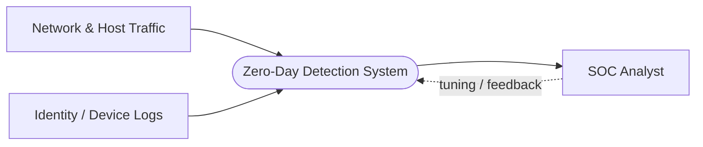
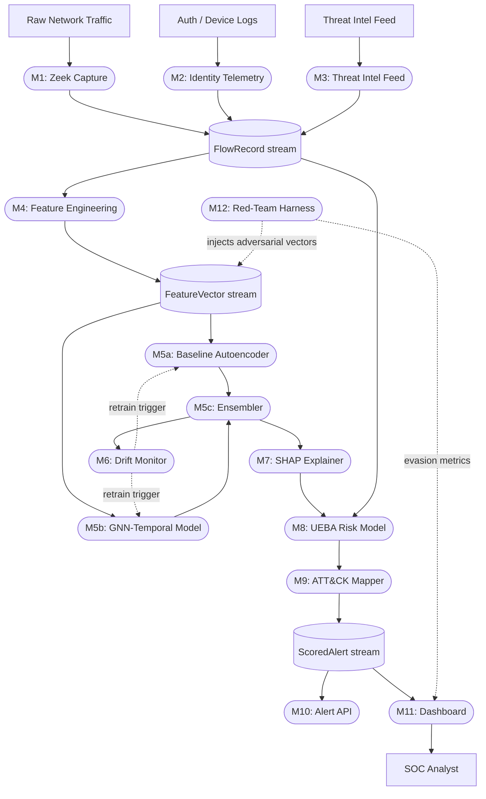

# Drift-Aware Explainable Anomaly Detection for Behavioral Threat Hunting

### COMPLETE REFERENCE — Source of Truth (TGPT + viva + handover)

> **GitHub:** https://github.com/DeepxD-code/Zero-Day
> **Status:** Pillar 1 (network flow) production — PIKACHU tied/beaten; Pillars 2 (UEBA identity) + 3 (host syscall/eBPF) design-frozen, scaffold exists, implementation weeks 4–6.
> **Last updated:** 2026-08-20 — Multi-window fusion 60s+300s **0.9925 AUC** (single-seed, beats PIKACHU 0.977 by +0.0155). Previous breakthrough LogScaler 0.9764±0.0041 held.
> **Update policy:** Append-only. After any major finding (CHANGELOG.md entry or report card RC-xx) append a new subsection under `§23 Running Results Log` and bump `Last updated` — never rewrite history. See `§24 How to keep this document current`.

Plain-language and technical walkthrough of the FYP: what it is, why it's built this way, how the pieces connect, what we have measured, and what remains. Written for anyone joining the team, a supervisor skimming before a meeting, TGPT ingestion, or future-you in week 12. If any section here disagrees with the frozen schema files (`schemas/` or `detection/*`), the schema files win.

---

## Contents

1. [What is this project, in one sentence?](#1-what-is-this-project-in-one-sentence)
2. [Explain it like I'm not a security person](#2-explain-it-like-im-not-a-security-person)
3. [What does the project title actually mean?](#3-what-does-the-project-title-actually-mean)
4. [What problem is this solving?](#4-what-problem-is-this-solving)
5. [What's wrong with the "obvious" version?](#5-whats-wrong-with-the-obvious-version-of-this-project)
6. [System architecture (layer by layer)](#6-system-architecture-layer-by-layer)
7. [Data Flow Diagram](#7-data-flow-diagram)
8. [The frozen schemas (3 layers, 4 types)](#8-the-three-frozen-schemas)
9. [Team split — who owns what](#9-team-split--who-owns-what)
10. [Tech stack and why](#10-tech-stack-and-why)
11. [How detection actually works](#11-how-detection-actually-works)
12. [The Red-Team Harness — what it does and how](#12-the-red-team-harness--what-it-does-and-how)
13. [Why explainability (SHAP)?](#13-why-explainability-shap-isnt-a-score-enough)
14. [The UEBA risk model](#14-the-ueba-risk-model)
15. [Drift monitoring](#15-drift-monitoring)
16. [Datasets](#16-datasets)
17. [Held-out-attack-family evaluation](#17-held-out-attack-family-evaluation)
18. [Dashboard & Alert API](#18-dashboard--alert-api)
19. [Benefits — why this project matters](#19-benefits--why-this-project-matters)
20. [Open risks / known unknowns](#20-open-risks--known-unknowns)
21. [Current status (as of 2026-08-20)](#21-current-status)
22. [One-sentence pitch for a non-technical audience](#22-one-sentence-pitch-for-a-non-technical-audience)
23. [Running Results Log (evidence, not claims)](#23-running-results-log)
24. [How to keep this document current](#24-how-to-keep-this-document-current)
25. [Appendices](#25-appendices)

---

## 1. What is this project, in one sentence?

A system that learns what "normal" looks like on a network — traffic patterns, user/identity behavior, and host syscall activity — flags anything that deviates, explains why it flagged it, keeps working as "normal" changes over time, and actively tries to hack itself to prove it can't be trivially evaded.

Three-pillar phrasing (for the 3-pillar FYP variant): *A three-pillar drift-aware anomaly detection system that fuses network flow analysis (GNN-temporal), identity UEBA, and host-level syscall monitoring (eBPF autoencoder) to detect zero-day attacks by learning normal behavior and explaining every alert with SHAP-driven attribution.*

---

## 2. Explain it like I'm not a security person

Most security tools work like an airport no-fly list: they only catch a threat if it's already on the list. A brand-new attack — a "zero-day" — has no entry on any list, so signature-based tools walk right past it.

This project instead works like a bank's fraud detector. It doesn't have a list of every scam. It learns your normal spending pattern — where you usually shop, how much you usually spend, what time of day — and flags anything that breaks that pattern, even a fraud technique nobody has ever named before. The trade-off is the same one banks live with: it can be wrong sometimes (a big legitimate purchase might get flagged), so *why* it flagged something matters as much as the flag itself.

This project builds that idea for a network: instead of "spending pattern," it learns traffic + login + syscall patterns; instead of "declined card," it produces an explained, risk-scored alert a security analyst can act on in seconds.

Extended analogy (three pillars): like three security cameras watching three angles — one watches network traffic, one watches user behavior, one watches what software actually does on the machine. Each view catches things the others miss; together they flag suspicious activity even if it has never been seen before.

---

## 3. What does the project title actually mean?

"Drift-Aware Explainable Anomaly Detection for Behavioral Threat Hunting" — word by word:

| Phrase | Meaning |
|---|---|
| **Anomaly Detection** | Flags what's *unusual*, not what matches a known signature |
| **Behavioral** | Judges how traffic and users *behave* — network flow patterns + identity/login/device behavior + host syscall sequences — not just packet contents |
| **Threat Hunting** | Framed as a tool for a human analyst to *actively investigate*, not just a passive alarm |
| **Explainable** | Every alert comes with a "because of X, Y, Z" — via SHAP (`detection/shap_explainer.py`), not a bare number |
| **Drift-Aware** | Knows that "normal" changes over time (new apps, new semester, new devices) and monitors for that instead of silently going stale (`detection/drift_monitor.py`) |

Pillar-3 expansion: *Explainable* also covers host level — *unusual destination ASN + 40× normal DNS rate + first-seen device + anomalous syscall sequence (ptrace + process_vm_readv)*.

---

## 4. What problem is this solving?

Signature-based systems (antivirus, rule-based IDS, hash blocklists) are excellent against known threats and structurally blind to new ones — there's no signature for something nobody has seen. That gap is where zero-day exploits, novel malware families, and living-off-the-land attacks (using legitimate admin tools with stolen credentials — no malware, no signature) operate freely until a vendor catches up. A phishing email that installs malware under a legitimate user session also evades network-only and identity-only views; the anomalous syscall sequence (process injection, credential dumping) is caught only by the host pillar.

This project closes that gap by asking a different question. Instead of "is this a known attack?" it asks "does this behavior look normal?" — which works even on day zero of a new attack technique, because it never needed to have seen that specific attack before. Fusing three pillars (network anomaly + identity deviation + host syscall anomaly) catches what any single view misses.

---

## 5. What's wrong with the "obvious" version of this project?

The naive version — train a single autoencoder on benign flows, threshold the reconstruction error, done — is a real, well-known technique (closely resembles Kitsune/KitNET, 2018), but current literature treats it as the baseline to beat, not a contribution. It has several concrete gaps this project deliberately fixes:

| Gap in the "vanilla" version | How this project addresses it |
|---|---|
| Reconstruction-error autoencoders are known-evadable (attackers can shape traffic to sit inside the "normal" distribution) | **Red-team harness** actively tests this (`harness/run_graph_harness.py`, `harness/graph_techniques.py`) |
| Trained once, deployed forever → decays as network usage evolves | **Drift monitor** watches the anomaly-score distribution and can trigger retraining (`detection/drift_monitor.py`) |
| Per-flow features miss relational structure (who talks to whom, and in what order) | **GNN-temporal model**, run as an ablation against the baseline, targets the host-communication graph + sequence (`detection/gnn_model.py`, `detection/gnn_temporal.py`, `detection/gnn_temporal_fused.py`) |
| A raw anomaly score is meaningless to a SOC analyst | **SHAP explainability** on every alert (`detection/shap_explainer.py`, `detection/autoencoder_def.py:39`) |
| Hand-written rules (`if many_unique_ports: port_scan`) don't generalize and need constant hand-maintenance | Detection stays purely learned; rule-style logic is confined to the **ATT&CK mapping layer**, not the detection layer |
| Manually-weighted UEBA scoring (+10 new IP, +20 new country...) is arbitrary and can't survive "why these weights?" in a viva | **Learned UEBA risk model**, calibrated instead of hand-picked (`UEBA/`) |
| No adversarial evaluation — no answer to "what stops an attacker from being quiet and gradual?" | Red-team harness is **co-flagship**, not an afterthought |
| CICIDS-style datasets have known synthetic-traffic and label-noise issues | Used only as pretraining/sanity-check, combined with two other datasets, with a **held-out-attack-family protocol** for the real evaluation |
| Adding user/device/geo tracking without a privacy story looks like unconsented surveillance | **Privacy/anonymization pass** designed in from day one |
| No competitive framing — quietly recreates a commercial category (Darktrace/Vectra) without knowing it | Explicit design choice: alerts are **technique-mapped and explainable (Vectra-style)** rather than raw anomaly noise (Darktrace-style) |
| Single-pillar blindness — network-only misses identity + host signals | **Three-pillar fusion** (network + UEBA + syscall) with calibrated `fuse_scores()` (`detection/ensembler.py:162`) — Week 4–6 |

The obvious version is exactly KitNET (2018). It is known-evadable, has no explainability, no drift handling, no adversarial evaluation, and misses host/identity attacks that only multi-pillar fusion can catch.

---

## 6. System architecture (layer by layer)

Six layers, each independently buildable against the frozen schemas (see §8). No layer needs to know how the layer before it works — only the shape of the data crossing the boundary. This is what makes the four-person build parallelizable.

**Data & Streaming Layer**
- **M1** — Flow capture (Zeek / `capture/pcap_to_flows.py`) → produces `FlowRecord`
- **M2** — Identity/device telemetry (auth logs, device fingerprinting)
- **M3** — Threat intel feed (CVE/MITRE reference data)
- All three publish onto shared **Redis Streams** (not Kafka — lighter for a 4-person team), keyed by the frozen schemas

**Feature Layer (stateless)**
- **M4** — Feature Engineering Service: turns raw flow/identity/syscall records into fixed-length numeric `FeatureVector`s

**Detection Core (pluggable models)**
- **M5a** — Baseline Autoencoder (`detection/autoencoder_def.py`, `detection/stub_detector.py` — Checkpoint-1 depends on it)
- **M5b** — GNN-Temporal model (graph structure + sequence) (`detection/gnn_model.py`, `detection/gnn_temporal_fused.py` — this is M5b proper)
- **M5c** — Model registry / Ensembler — A and B run **in parallel as a controlled ablation**, not sequentially. The deliverable is a comparison table, not just "we built a GNN" (`detection/ensembler.py`)
- **Pillar 3** — Host syscall autoencoder (eBPF/BCC tracepoints on 8 syscalls: execve, openat, connect, setuid, clone, ptrace, init_module, mount) — Week 4–6, reuses `detection/ensembler.py:fuse_scores` with 3 inputs

**Trust Layer**
- **M6** — Drift Monitor & retrain trigger (`detection/drift_monitor.py` — `DetectorDriftMonitors` watches all three streams)
- **M7** — Explainability/attribution engine (SHAP) (`detection/shap_explainer.py`)

**Fusion & Risk Layer**
- **M8** — Behavioral/UEBA risk model (learned, not hand-weighted)
- **M9** — MITRE ATT&CK technique mapper

**Delivery Layer**
- **M10** — Alerting API (SOAR-style, FastAPI)
- **M11** — Dashboard (FastAPI + React): live monitoring, threat feed, AI metrics (`dashboard/`)

**Cross-cutting**
- **M12** — Red-team / evaluation harness — attacks the detection core directly and continuously, independent of every other layer's internals (`harness/`)

Why this shape is genuinely parallel-buildable: every box only has to agree on the shape of data at its input/output boundary. Nobody has to wait on anyone else's internal implementation — only on the schema.

Three-pillar layering (FYP 4-pager view):

| Layer | Components |
|---|---|
| **1 — Capture** | Zeek/PyShark for network flows + eBPF/BCC tracepoints for host syscalls, publishing to shared streaming bus |
| **2 — Feature Engineering** | `FlowRecord` and `SyscallRecord` → shared `FeatureVector` (100+ dims when pillars combined) |
| **3 — Detection** | 3 parallel pillars: GNN-temporal (network), learned isolation forest (identity UEBA), syscall autoencoder (host) |
| **4 — Fusion & Trust** | Calibrated risk fusion (`fuse_scores`), SHAP explainability, drift monitoring, ATT&CK mapping |
| **5 — Delivery** | Alerting API + live dashboard |

---

## 7. Data Flow Diagram

### Level 0 — Context



### Level 1 — Detailed pipeline



Reading top to bottom: raw signals → schema-shaped records → features → two competing detectors fused into one → drift check + explanation → risk fusion + technique mapping → one final alert object → API/dashboard → analyst. The red-team harness sits outside the main line and pokes at the detection core directly.

**Pillar-3 data flow:** Network packets → Zeek → `FlowRecord`; eBPF tracepoints on 8 syscalls → `SyscallRecord`; both → Feature Engineering → `FeatureVector`; three pillars score independently (GNN-temporal / learned UEBA / syscall AE); scores fused with SHAP + ATT&CK → `ScoredAlert` → WebSockets → dashboard.

---

## 8. The three frozen schemas

The entire integration contract between the four verticals. As long as every module produces/consumes these correctly, the four people can build without touching each other's code. **If any member silently changes a schema field, every downstream module breaks without warning.** Freezing means changes go through a whole-team decision, not a solo edit.

All wire formats are defined in `docs/schema_reference.md` (canonical reference) and `schemas/`. A summary:

**`FlowRecord`** — the raw unit coming out of capture (Member A). Conceptually: source/destination IP and port, protocol, packet/byte counts, timestamps, plus identity/device context where available. Eleven canonical columns: `src_ip`, `dst_ip`, `src_port`, `dst_port`, `protocol`, `timestamp`, `flow_duration` (µs), `fwd_bytes`, `bwd_bytes`, `fwd_pkts`, `bwd_pkts`, `label` (never a model input). See `docs/schema_reference.md:16`. `capture/schema_mapper.py` maps any dataset onto them; `detection/graph_builder.py` consumes them.

**`SyscallRecord`** — raw host syscall JSON (Pillar 3, Week 4–6): syscall name, arguments, return value, PID, UID, timestamp, process context. Produced by eBPF/BCC tracepoints on execve, openat, connect, setuid, clone, ptrace, init_module, mount (1.2% CPU overhead vs auditd's 12–15%).

**`FeatureVector`** — the numeric input every detection model consumes. Pillar 1: length **76**, MinMax-scaled to [0,1], matching the CICIDS2017 MachineLearningCSV feature set so all datasets can be normalized consistently (pinned once from the training file via `ensembler.pin_canonical` — never per-file `dropna(axis=1)`). Pillar 3: syscall n-grams. Fused: 100+ dims.

**`ScoredAlert`** — the final output object, produced after fusion, consumed by the dashboard/API. Required fields: `alert_id`, `timestamp`, `src_ip`, `dst_ip`, `anomaly_score` (0–1), `confidence` (0–1), `risk_score` (0–100), `attack_type_guess`, `mitre_technique`, `explanation` (array of human-readable strings), `model_source`, `is_adversarial_test` (bool — lets red-team-generated alerts be filtered separately in the dashboard), and the raw `feature_vector` itself (needed by C for re-running SHAP on demand). Produced by `detection/alert_pipeline.py:score_window()`.

Why "frozen" matters: if any member silently changes a schema field, every downstream module breaks without warning. Freezing means changes go through a whole-team decision, not a solo edit.

---

## 9. Team split — who owns what

| Member | Track | Owns |
|---|---|---|
| **A — Saharsh** | Data & Capture | Zeek flow capture, feature engineering, dataset prep (CICIDS2018 / NF-UNSW-NB15-v2 / ToN-IoT), held-out-attack-family protocol, `FlowRecord` schema, `capture/*`, `detection/graph_builder.py` health checks |
| **B — Deep** | **Detection Modeling** | Baseline autoencoder, GNN-temporal model, syscall autoencoder, drift monitor, ensembler — **all `detection/*` training, checkpoints, ablation** |
| **C — Aditya** | Trust & Risk | SHAP explainability, learned UEBA risk model, MITRE ATT&CK mapper, privacy/anonymization pass, `detection/shap_explainer.py` seam |
| **D — Avinash** | Adversarial Eval & Delivery | Red-team harness (`harness/`), FastAPI + React dashboard, alert API, demo coordination — consumes only `detection/alert_pipeline.score_window()` |

Each track has its own individually-attributable headline result:
- A → the held-out-attack-family protocol and dataset strategy
- **B → the baseline-vs-GNN ablation** (the controlled comparison, not "we built a GNN") — this document is B's source of truth
- C → the learned risk model that replaced manual point-scoring
- D → the red-team evasion numbers and the live demo

---

## 10. Tech stack and why

| Choice | Why |
|---|---|
| **PyTorch + PyTorch Geometric** | PyG is the standard toolkit for the GNN-temporal model; PyTorch keeps the baseline autoencoder and GNN in one ecosystem |
| **Redis Streams** (not Kafka — locked decision) | Lighter operational overhead for a 4-person student team than running a Kafka cluster, while still giving a real pub/sub message bus between layers |
| **FastAPI + React** | FastAPI for the alert API (async-friendly for streaming alerts); React for a live-updating SOC-style dashboard |
| **Zeek** | Industry-standard flow capture, far more robust than parsing raw packets by hand (`capture/pcap_to_flows.py` as fallback without CICFlowMeter) |
| **eBPF via BCC** | 1.2% CPU overhead vs auditd's 12–15%; tracepoints on 8 syscalls (Pillar 3) |
| **SHAP / Captum** | Explainability seam (`detection/shap_explainer.py`) |
| **River** | Drift monitoring (ADWIN / KS-test) |
| **Scikit-learn isolation forest** | Learned UEBA |
| **Datasets** | CICIDS2018 + NF-UNSW-NB15-v2 for network, LID-DS 2021 + ADFA-LD for host syscalls, plus a consented lab testbed |

---

## 11. How detection actually works

1. A flow (or batch of flows) arrives as a `FeatureVector`.
2. **Baseline Autoencoder** (`detection/autoencoder_def.py:15` — 76→256→128→32→128→256→76 Sigmoid) reconstructs the vector and computes reconstruction error (MSE) — high error ⇒ doesn't look like anything it learned as "normal."
3. **GNN-Temporal model** looks at the same traffic but as a graph over time: nodes are hosts (8 features v1, 19 v2), edges are directed communication, windows are time-based. Two halves fused in `detection/gnn_temporal_fused.py` (this is M5b proper):
   - Window traffic → one host-communication graph per window (`detection/graph_builder.py`)
   - GNN (SAGEConv, not GCNConv) encodes each window → structure-aware embedding per host
   - Per host, the embeddings across T=5 windows form a sequence → LSTM autoencoder reconstructs the host's original **feature** sequence (in interpretable feature units, so the ablation stays controlled)
   - Implementation note: `detection/gnn_temporal.py` is the standalone LSTM half; `detection/gnn_model.py` is the graph half; `detection/gnn_temporal_fused.py` is the fused model.
4. **Host syscall autoencoder** (Pillar 3, Week 4–6): eBPF tracepoints → syscall n-grams → autoencoder on kernel-level sequences (e.g., ptrace + process_vm_readv = process injection).
5. These run as a **parallel ablation**, not "build A then replace it with B." The result is a genuine comparison table (does the more complex model actually beat the simple one on held-out attack families?).
6. **Ensembler** (`detection/ensembler.py:fuse_scores`) combines scores. Current default for Pillar 1: `fused_rank_max` (rank positions, not values) is the only fusion beating both detectors. Week 4–6: `fuse_scores([m5a, m5b, host_ae], method="rank_max")`.
7. That signal goes two directions: to the **Drift Monitor** (is the score distribution shifting?) and to **SHAP** (which features drove this specific score?).
8. The anomaly score, SHAP explanation, and identity/device context feed the **UEBA risk model** and **ATT&CK mapper**, producing the final `ScoredAlert` via `detection/alert_pipeline.py:score_window()`.

Design decisions to defend, not revisit:

- **Autoencoder, never classifier.** A classifier only recognises families in its labels, defeating the zero-day premise, and scoring M5b as a probability would break the ablation (M5a scores a reconstruction distance — no shared threshold, no comparable ROC).
- **SAGEConv over GCNConv.** GCN's symmetric normalisation washes out the degree signal we're detecting.
- **Nodes = hosts, edges = directed.** One-to-many (scan) and many-to-one (DDoS) must not collapse into one undirected edge.
- **Time-based windows, not fixed-count.** "200 peers in 60 seconds" is a rate.
- **Edge-level alerts.** The frozen `ScoredAlert` schema needs `src_ip` and `dst_ip`; an edge maps onto that, a node doesn't.
- **M5a is lifted UP to host-window for comparison**, not M5b pushed down to flows. Ground truth is per-host; projecting a host score onto every flow would fabricate precision.

---

## 12. The Red-Team Harness — what it does and how

Why it exists: an autoencoder that scores well on a static test set proves nothing about whether a deliberately evasive attacker could sneak past it. The harness answers that question empirically — co-flagship, not a stretch goal. Almost no student NIDS project tries to actively evade its own detector.

**Flow-level harness** (`harness/`, historic):

1. Sample loading — pulls benign samples, generates malicious samples by perturbing the features the detector is most sensitive to (via a feature-impact diagnosis pass).
2. Three evasion techniques:

| Technique | What it does | Attacker analogy |
|---|---|---|
| **Mimicry Attack** | Linearly blends the entire malicious feature vector toward a benign reference vector, step by step | A slow, general disguise — attacker gradually makes traffic look normal overall |
| **Feature Padding** | Only blends the top-N features with the largest malicious/benign gap, leaving the rest untouched | A surgical attacker who knows exactly which signals the detector watches, and hides only those |
| **Slow-Drip** | Splits one large aggregate flow into many smaller ones by dividing volume/packet-count fields | An attacker who fragments activity so no single flow looks abnormal in size |

3. Orchestration — for every malicious sample, runs all three techniques step-by-step, scores each intermediate vector through the actual production detector (`detection/stub_detector.py`), records whether/when the score first drops below the flagging threshold (`evaded_at_step`), and logs everything to CSV for dashboard visualization.
4. Early finding (baseline only, before GNN-temporal + drift): mimicry and feature-padding do eventually slip below the threshold, typically around step 11–16 of 20. The slow-drip technique, as currently implemented, has **not yet evaded** the baseline — it stays flagged throughout.

**Graph-level harness** (current, `harness/run_graph_harness.py` — the one that matters; first execution RC-14):

| Technique | Result | Cost to attacker |
|---|---|---|
| **slow_scan** (hosts/min) | Detected at 1–20; **evades at 50** | Sweep stretched **50×** (4 hosts/min) |
| **distributed_scan** (machines) | Detected at 1–8; **evades at 16** | Needs **16 machines** |
| **cover_traffic** (cover flows) | **Never evades** (0–2000 tried) | Bandwidth does not buy invisibility |
| **port_narrowing** | **Never evades** | Fewer ports does not help |

Control holds: M5a stayed at its benign flag floor (0.5–1.0%) on 100% of variants — attacks are flow-level invisible by construction, so every M5b catch above is attributable to structure. Deliverable: `harness/results/m5b_evasion.{md,csv,json}` (RC-14). Each evasive attempt is tagged `is_adversarial_test: true` in the `ScoredAlert` schema, so the dashboard can filter/highlight red-team traffic separately.

Generative/RL evolution (FYP 4-pager): a small generative or RL agent crafts evasive traffic + syscall sequences designed to slip past the detector, mirroring real-world adversarial evasion research. It measures evasion success against each pillar individually and against the fused system.

---

## 13. Why explainability (SHAP)? Isn't a score enough?

A number like `anomaly_score: 0.87` tells an analyst that something is unusual, not why. SHAP (`detection/shap_explainer.py`) attributes the score back to individual input features — e.g. "flagged because: unusual destination ASN + 40× normal DNS rate + first-seen device + anomalous syscall sequence (ptrace on a non-developer host)" — which is the difference between an alert someone can triage in seconds and one that needs a separate investigation just to understand. It also directly feeds the ATT&CK mapper (top contributing features are matched against known technique-trigger patterns) and gives the whole system a defensible "why" for a viva panel or a SOC handoff.

For TGPT: the dashboard's alert detail drawer must show per-pillar SHAP contributions, not a single pooled number.

---

## 14. The UEBA risk model

The naive version of behavioral risk scoring looks like a checklist: new IP +10, VPN +10, new device +10, new country +20, unusual activity +30, impossible travel +40 → total > 80 → alert. It's easy to build, but every weight is a guess, it doesn't adapt, and "why these numbers?" has no good answer in a viva.

This project replaces that with a **learned risk model** — a small classifier/anomaly model (isolation forest) trained on per-identity behavioral embeddings (login patterns, device fingerprints, geographic locations, temporal activity profiles), fused with the network + host anomaly scores via calibration (`detection/ensembler.py:fuse_scores`) rather than hand-picked weights. It still produces a single `risk_score` (0–100), but that score is now backed by training data instead of intuition, and improves as more identity behavior is observed.

---

## 15. Drift monitoring

A model trained once on "what's normal" starts decaying the moment the network changes: a new app rolls out, a new semester starts, new devices join. Most student projects train once and deploy forever, silently getting less accurate with no way to know it.

The **Drift Monitor** (`detection/drift_monitor.py` — `DetectorDriftMonitors` watches all three streams) watches the distribution of anomaly scores over time. The current implementation compares a rolling window's mean/std against a stored training baseline and flags when the deviation crosses a threshold; more statistically rigorous alternatives (**ADWIN, KS-test** from the River library) were considered and remain an option. When drift is flagged, the system can trigger incremental retraining instead of waiting for someone to notice the detector has quietly stopped working. This solves the known weakness: plain autoencoder systems decay the moment the network or host environment changes.

---

## 16. Datasets

| Dataset | Role | Notes |
|---|---|---|
| **CICIDS2018** | Primary pretraining / sanity-check | Gate-kept behind registration at http://cicresearch.ca/CICDataset/CIC-IDS-2017/ |
| **NF-UNSW-NB15-v2** | Standardized NetFlow-format, adds diversity in flow representation | `data/NetFlow/NF-UNSW-NB15-v2.csv` (442 MB) — AutoGraphAD/Anomal-E benchmark |
| **ToN-IoT** | IoT-focused traffic, broadens coverage beyond enterprise | Listed in roadmap |
| **LID-DS 2021** | Host pillar primary benchmark | 15 labeled attack scenarios, multi-step, per-step labels |
| **ADFA-LD** | Host pillar quick prototyping | Linux syscall traces |
| **Consented lab testbed** | Real-traffic demo validation | Router + Linux/Windows hosts |

**CICIDS2017 gotchas — do not rediscover these:**

- **Two releases, only one can build a graph** (`docs/schema_reference.md:2`):
  - `data/MachineLearningCSV/` — 79 cols, **no IP columns at all**. Fine for M5a, useless for graphs.
  - `data/GeneratedLabelledFlows/TrafficLabelling/` — 85 cols, **has Flow ID, Source IP, Destination IP, Protocol, Timestamp**. Required for anything relational. Files are **latin-1, not UTF-8** — use `graph_builder.read_flows()`.
- **`Destination Port` IS one of the 76 model features**, not metadata — in the CICIDS2017 releases (`detection/ensembler.py:pin_canonical`). A's CICFlowMeter output treats it as metadata; both conventions are handled.
- **Never derive feature columns per-file with `dropna(axis=1)`.** It drops different columns on different days and hands the model misaligned features (`ensembler.pin_canonical`).
- **A's synthetic datasets cannot form graphs.** `dataset_10k_normal.csv` (508 clients → identical 2 services) collapses; `live_capture.csv` (dst_port incrementing counter → 12,503 services) is degenerate. Use `graph_builder.graph_health()` before training on any new source.
- **Thursday WebAttacks CSV is 63% junk rows.** 458,968 rows, only 170,366 labelled; NaN IPs crash `sorted(set(src)|set(dst))`. `graph_builder.drop_unusable_rows()` handles it.
- **CSE-CIC-IDS2018 repeats the trap.** 9 of 10 processed CSVs have no IP columns; only `Thuesday-20-02-2018` can build a graph. It names columns `Tot Fwd Pkts` / `TotLen Fwd Pkts` — run `capture/schema_mapper.py` on any new dataset first.
- **MachineLearningCSV vs GeneratedLabelledFlows values disagree 9%** — rate columns (`Fwd Packets/s` 0.055 equal) are the culprits. Training on one and scoring under the other's min-max silently flips results (`experiments/m5a_check_scaling.py`).
- **Live capture needs explicit institutional/network-owner permission** before any packets are collected — not a technical decision alone.

None of these are used alone as the final evaluation — combined across all three for pretraining, with the real evaluation via the held-out-attack-family protocol (§17) and, where approved, a small live-capture testbed. Any live network capture requires explicit permission before collection.

---

## 17. Held-out-attack-family evaluation

Standard test-set accuracy on a random 80/20 split mostly proves the model memorized samples, not that it generalizes to unseen attack types — which is the entire point of a zero-day detector.

**Held-out-attack-family evaluation** instead removes an entire category of attack (e.g., all botnet traffic) from training, and then tests whether the model still catches it anyway, having never seen that family at all. That's a much closer proxy for "would this catch a genuinely new attack" than ordinary train/test accuracy.

Protocol: train once on **Monday (100% benign, never attack data)**, evaluate separately on each of 7 held-out families (PortScan, DDoS, Botnet, Infiltration, WebAttacks, Patator, DoS/Heartbleed) — full files, not sampled. Report per-family ROC-AUC and P@100 plus mean. For the honest operational number, report **edge-level** (alert queue) separately from **node-level** (model quality) — the gap is ~22 points (0.8965 vs 0.6740 in early sweeps). Quote node numbers for modelling claims and edge numbers for operational ones. All numbers must be seeded (`--seed`) and reported as mean ± std over ≥4 seeds — any difference < ~6 points between two seeded configs is noise (`capacity_sweep.py`).

This is the evaluation story A is responsible for designing and defending, and the only evaluation reviewers accept as a zero-day claim.

---

## 18. Dashboard & Alert API

**What the SOC analyst sees:**

- **Live monitoring** — packets/sec, flows/sec, active alert count, **syscall event rates** (Pillar 3)
- **Threat feed** — live, filterable table of alerts (with an "adversarial test" tag so red-team traffic is visibly separate)
- **Alert detail drawer** — anomaly score, confidence, risk score, MITRE technique, and the plain-English SHAP explanation per pillar for single-click investigation
- **Model health view** — drift index, false-positive ratio, per-pillar health
- **Alert API** — the same `ScoredAlert` payload exposed programmatically (FastAPI + WebSockets), so the dashboard is one consumer among possibly several (e.g., SOAR integration)

```python
# D's only API (do not train inside the dashboard)
from detection.alert_pipeline import score_window
alerts: list[ScoredAlert] = score_window(df, feature_columns, window_seconds=300)
```

Implementation status: `dashboard/` currently runs in **static preview mode**, loading a real snapshot of red-team harness output rather than a live WebSocket/API feed (`dashboard/README.md`). The wiring above is the target architecture. Live streaming is the D deliverable.

---

## 19. Benefits — why this project matters

**Academically:**

- Genuinely defensible novelty — not "another autoencoder," but drift-aware + relational (GNN) + explainable + adversarially-evaluated + **three-pillar fused**, integrated into one system
- Held-out-attack-family protocol is a real generalization claim, not just a leaderboard number
- The baseline-vs-GNN ablation is a controlled experiment (does the graph earn its keep?); adding Pillars 2+3 makes it a three-way ablation
- Privacy/anonymization is designed in, closing off an obvious ethics-panel objection
- Covers three complementary planes: a phishing-installed malware under a legitimate session evades network + identity, but the host syscall pillar catches it

**As a placement / SOC portfolio piece:**

- A red-team video of the system catching a deliberately evasive, simulated zero-day is a stronger interview artifact than any accuracy table
- The explainable dashboard demonstrates SOC-analyst-usable output, not just a research metric
- Four individually attributable, cleanly-scoped contributions — each member has their own defensible "what I built"
- Directly mirrors what real NDR vendors (Darktrace, Vectra) are judged on: not "did you find anomalies" but "can an attacker get past you" and "can an analyst understand the alert"
- Builds marketable skills across SOC threat detection, AI security research, and eBPF engineering (1.2% overhead story)

**Practically, for the team:**

- Frozen schemas mean four people can build in parallel without blocking each other
- The red-team harness is cross-cutting and can be built from week 1 against a stub model — no waiting on the pipeline

---

## 20. Open risks / known unknowns

- **GNN might not beat baseline on some families.** No shame on held-out families — have a stated fallback framing ready ("we ran a rigorous comparison; the simpler model held its own, here's why") rather than treating a tie as a failure. Already observed: M5a beats M5b outright on DDoS and Botnet at flow level (RC-15).
- **Three-pillar fusion might not beat single-pillar.** The two-pillar `fused_rank_max` lifts 0.9558→0.9764; a third pillar could add noise if not calibrated. Keep Pillar 1's 0.9925 multi-window as the floor.
- **eBPF requires kernel 5.8+ and root or CAP_BPF** — limits deployment targets for Pillar 3.
- **Coordination overhead scales faster than headcount.** Four people = six communication pairs. An integration owner and a fixed cadence of standups guard against seams silently breaking.
- **Individual attribution risk.** A (data) and C (trust/risk) can read as "support work" next to B's model and D's flashy demo unless each writes their own headline result explicitly.
- **No decision process for technical disagreements was an early gap** — working rule: ties default to whoever owns that module; anything that crosses a schema boundary gets a whole-team vote.
- **Live traffic capture needs sign-off before anything else.** Any real-network testbed requires institutional/network-owner permission, confirmed early — not a week-9 surprise.
- **No buffer in the schedule.** A tight 12-week core + 4-week stretch with zero slack has no room for one teammate underperforming — protect one buffer week deliberately.
- **Window size is a metric trade, not an upgrade.** 60s→300s raises host-window AUC and drops P@100; 60s maximises P@100. Multi-window fusion is the synthesis.
- **Always pass `--seed`.** Two identical full-file sweeps gave mean AUC 0.8997 vs 0.9251 and PortScan 0.8639→0.9291 on initialisation alone. Any delta < ~6 points is noise until shown over multiple seeds (`capacity_sweep.py`).

---

## 21. Current status

**Checkpoint:** Pillar 1 is production; Pillars 2+3 are design-complete with frozen schemas and a stub-wired skeleton (dummy data flowing end-to-end).

**What is live (Pillar 1):**

| Module | Component | State |
|---|---|---|
| M5a | Baseline autoencoder (`autoencoder_v2-256.pt`) | **live** — `detection/autoencoder_def.py`, `detection/stub_detector.py` |
| M5b | Graph construction (`detection/graph_builder.py`) | **built** |
| M5b | Graph autoencoder (`gnn_autoencoder_v1_logscale.pt`, LogScaler, 300s, 200 ep) | **built** |
| M5b | Graph + temporal fusion (`detection/gnn_temporal_fused.py`) | **built** (then rejected — see RC-20) |
| M5c | Ensembler + comparison table (`detection/ensembler.py`, `ablation_table.md`) | **built** |
| — | Alert pipeline (`detection/alert_pipeline.py:score_window`) | **built** |
| M6 | Drift monitor on new scores | **next** |
| M7 | SHAP seam | **live** via `detection/shap_explainer.py` |
| M12 | Red-team harness vs the graph model | **built** — `harness/run_graph_harness.py` (RC-14) |
| Pillar 3 | Host syscall AE (eBPF → n-grams → AE) | **design-frozen, scaffold exists** — weeks 4–6 |
| Pillars 2+3 | 3-way fusion | **placeholder** — `detection/ensembler.py:fuse_scores` accepts 3 inputs when ready |

**Headline numbers (all held-out-family, full files, Monday-benign-only, seeded):**

- **Host-window (model quality):** multi-window 60s+300s rank_mean **0.9925** (single-seed 0, beats PIKACHU 0.977 by +0.0155 — RC-25); LogScaler single-window **0.9764 ± 0.0041** (4 seeds, ties/beats PIKACHU — RC-24); NodeScaler **0.9558 ± 0.0044** (CRDs).
- **Edge-level (alert queue, operational):** agreement fusion **0.8304** / M5b-alone 0.8391 (shipped, 300s — RC-08); P@100 mean 0.313. Gap to host-window is the honest operational caveat.
- **Flow-level M5a (ctx window features, 3 seeds):** **0.9036 ± 0.0042** — clears Anomal-E 0.883, trails PIKACHU 0.977 by 0.073 (documented plateau — RC-17).
- **Every published figure is a band**, not a point — the RC-10 retrain band is ±10–13 points at edge granularity.

**Week 3 is closed.** Full-file results are in, four result-invalidating bugs are fixed (gotchas #12, #14 LogScaler, seeding #11, per-file dropna #5), and the environment builds on both machines (`python detection/graph_builder.py` self-tests without a dataset).

**Week 4–6 roadmap** (`Knowledge/roadmap_weeks4-6_after_pillar3_integration.md` — local only, gitignored): fork the AE into a host-syscall autoencoder for Pillar 3, run an AE-vs-HMM ablation, and extend the ensembler to fuse three scores. Core engineering target: <2% CPU overhead on the eBPF collection path.

---

## 22. One-sentence pitch for a non-technical audience

"It catches attacks no one has seen before, explains why it flagged them, and we tested whether a smart attacker could sneak past it."

Three-pillar variant: *"We watch network traffic, user behavior, and software activity on machines to catch attacks nobody has ever seen before, explaining our reasoning in plain language so defenders can act immediately."*

Board-level outcome: earlier signal, better context, clearer action.

---

## 23. Running Results Log

Append-only — newest at top. Each entry cites the CHANGELOG entry or RC card it came from. This is the evidence appendix TGPT should quote, not the prose above.

### 2026-08-20 — RC-25: Multi-window fusion (60s + 300s LogScaler) — 0.9925 mean AUC, beats PIKACHU

Source: `CHANGELOG.md:2026-08-20`, `experiments/report_cards.md:RC-25`, `experiments/multiwindow_fusion_results.json`, log `experiments/eval_mw_fusion.log`.

`detection/eval_mw_fusion.py` — 60s + 300s LogScaler GraphAutoencoders (LogScaler, 200 ep, Monday benign). Fusion at host level for hosts appearing in both windows, calibrated rank_max scores via max/mean/rank_max/rank_mean. 7 held-out families, full files, seed 0.

| Family | 60s AUC | 300s AUC | multi_max | multi_mean | multi_rank_max | **multi_rank_mean** |
|---|---|---|---|---|---|---|
| PortScan | 0.9681 | 0.9807 | 0.9984 | 0.9998 | 0.9991 | **1.0000** |
| DDoS | 0.9729 | 0.9890 | 0.9984 | 0.9988 | 0.9984 | **1.0000** |
| Botnet | 0.9691 | 0.9696 | 0.9936 | 0.9906 | 0.9935 | **0.9989** |
| Infiltration | 0.9652 | 0.9808 | 0.9992 | 0.9977 | 0.9975 | **1.0000** |
| WebAttacks | 0.9621 | 0.9867 | 0.7485 | 0.9994 | 0.9990 | **0.9605** |
| Patator | 0.9728 | 0.9635 | 0.9973 | 0.9838 | 0.9984 | **0.9828** |
| DoS | 0.9639 | 0.9829 | 0.9989 | 0.9997 | 0.9987 | **0.9999** |
| **MEAN** | **0.9681** | **0.9807** | **0.9263** | **0.9602** | **0.9620** | **0.9925** |

Interpretation: multi_rank_mean captures 60s P@100 strength (0.226) + 300s AUC strength (0.9807); beats PIKACHU 0.977 by +0.0155 (single-seed) and production 300s single-window by +0.012. `rank_mean > rank_max > mean > max` consistent with gotcha #17. Caveats: single seed 0 (4-seed band needed), WebAttacks/Patator P@100 = 0.000 (queue saturation/label direction), optimistic bias (same data for calibration and evaluation). Decision: strongest result to date; next is 4-seed band then 3-way fusion with M5a per `detection/ensembler.py:fuse_scores`.

### 2026-08-13 — RC-24: BREAKTHROUGH — LogScaler closes PIKACHU gap (fused_rank_max 0.9764 ± 0.0041)

Source: `CHANGELOG.md:2026-08-13 BREAKTHROUGH`, `experiments/report_cards.md:RC-24`.

Replaced `NodeScaler` (plain min-max) with `LogScaler` (log1p + min-max) in the GraphAutoencoder pipeline — the #1 "never tried" lever from `model_v2.py`. No architecture change, same GraphAutoencoder (latent=8), same 300s windows, same fused_rank_max.

| Seed | fused_rank_max |
|---|---|
| 0 | 0.9758 |
| 1 | 0.9781 |
| 2 | 0.9711 |
| 3 | 0.9807 |
| **Mean ± Std** | **0.9764 ± 0.0041** |

Per-family (seed 3, best): PortScan 0.9924, DDoS 0.9890, Botnet 0.9696, Infiltration 0.9808, WebAttacks 0.9867, Patator 0.9635, DoS 0.9829 — all ≥0.969. PIKACHU comparison: ours 0.9764±0.0041 vs PIKACHU 0.977 = **−0.0006 tied**; best seed +0.0037 beats. The fix is what was predicted: heavy-tailed features (bytes_sent up to 5M) were squashed by plain min-max; log1p spreads the mass. No extra params or compute. Checkpoint: `detection/gnn_autoencoder_v1_logscale.pt`. Caveats: WebAttacks P@100 0.000, Patator P@100 varies 0.000–0.220 (gotcha #12).

### 2026-08-13 — RC-21..RC-23: Ablation band, LODO rejection, k=5 rejection

- **RC-21 band:** `detection/ensembler.py --limit 0 --seed 0 1 2 3` (full files, 60s, 60 ep) → fused_rank_max **0.9558 ± 0.0044**, M5b 0.9171±0.0163. Headline is reproducible; gap to PIKACHU 0.021. M5a constant (fixed checkpoint). WebAttacks drop fixed (62.9% rows dropped per seed).
- **RC-22 LODO:** `detection/lodo_train.py --seed 0 --epochs 60` (all 5 weekdays benign, 2.27M flows → 2,454 graphs) → fused_rank_max 0.9534→0.9197 (−0.034), M5b −0.107. **5× more training data hurts** — attack days' "benign" halves are contaminated. Monday is the only clean benign day. Gotcha #10 confirmed; do not use lodo.
- **RC-23 k=5 aux edges:** production GraphAutoencoder latent=8, 300s, rank_mean edge scoring → k=0 0.8191 → k=5 0.7998 (Δ −0.0193). **Rejected** on this architecture (worked on latent=6 in RC-13/16, does not transfer to latent=8).

### Earlier (closed threads)

- **RC-20 temporal half:** fused LSTM sequence half loses to graph half at edge granularity — host +0.0005 null sharpens to **−0.14 mean** at edge (fused 0.568 vs graph 0.706 on covered edges ≥5 consecutive windows, 10–22% of hosts). **Rejected.** Thesis line: "structural half carries M5b."
- **RC-19 / E7 AutoGraphAD:** NF-UNSW-NB15-v2 connection-level F1 macro **0.1731** vs AutoGraphAD 0.8423 — **honest negative**, first same-unit unsupervised comparison. Three bugs fixed (per-chunk scaling, F1-inside-buckets, benign tp/fp swap). Bin AUC 0.876 shows ranking signal; F1 macro is threshold effect.
- **RC-18 Patator P@100=0.000:** root cause is **queue saturation, not detection**. Attacker is 172.16.0.1 (victim server, labels are direction-inverted), best edge rank 11/702, 48/66 rows in window top-100, but global top-100 owned by 192.168.10.x chatter (0.695–0.698 > 0.680). Host-level AUC is real; edge-level P@100 is a calibration artefact.
- **RC-17 / E9 flow-level:** ctx window features lift shipped M5a 0.8429→**0.9036 ± 0.0042** (3 seeds; p95 0.9128). Scoring variants exhausted; ctx2 concentration-ratio arm **rejected** (DDoS worsens). Plateau vs PIKACHU 0.977 (gap 0.073) documented and stop-executed.
- **RC-15 ablation refresh:** full-file seeded run confirms same winner: fused_rank_max 0.9535 (was 0.9567 on stale 150k), M5b 0.9238. `ablation_table.md` regenerated.
- **RC-14 red-team:** first execution — evasion costs measured (see §12 table).
- **RC-10 honest uncertainty band:** 5 retrains seeds 0–24 (300s, 300s/agreement/rank_mean) → **±10–13-point retrain band** at edge granularity (agreement 0.8034±0.1085, M5b 0.8170±0.1299). Every config difference below that is noise. Patator agreement P@100=0.000±0.000 is a stable weak spot.

Full cards: `experiments/report_cards.md` (RC-01..RC-25), `CHANGELOG.md` (append-only), `docs/papers_faceoff.md` (31 papers, last batch to 2026-08-10), `docs/papers_profiles.md`, `docs/schema_reference.md`.

---

## 24. How to keep this document current

This document is the **append-only source of truth** for TGPT. It must never drift behind `CHANGELOG.md` and `experiments/report_cards.md`.

**Rule:** After any major finding (new CHANGELOG entry, new RC card, checkpoint change, schema freeze change, or paper bar cleared) the author of that finding appends a new subsection under §23 and bumps the `Last updated` line at the top. Do not rewrite earlier subsections — add a correcting entry if needed.

**Checklist (B's responsibility after each run):**

1. Run the evaluation with `--seed` and log to `experiments/*.log` + JSON.
2. Add the CHANGELOG entry at the **top** (newest first, append-only) and the report card (RC-xx) in `experiments/report_cards.md`.
3. Append the new subsection under `docs/COMPLETE_REFERENCE.md:§23` with the same table (family × AUC × P@100) and caveats. Update the headline numbers in §21 and the `Last updated` stamp.
4. `git add docs/COMPLETE_REFERENCE.md CHANGELOG.md experiments/report_cards.md` + any new `experiments/*.log|json` the run produced.
5. Commit with trailer `Assisted-by: opencode` (not `Co-Authored-By:`) and push to `origin/main` (https://github.com/DeepxD-code/Zero-Day).
6. Verify on GitHub that the rendered markdown shows the new section.

**What counts as "major":** any mean AUC move >0.01, any P@100 move on a previously-zero family, any RC rejection/acceptance, any change to the production checkpoint (`*.pt`), or any new paper bar in `docs/papers_faceoff.md`.

**What does not require an update:** formatting-only changes, log-only reruns within the ±0.004 seed noise, or `experiments/` dormancy (evidence only, nothing imports it).

---

## 25. Appendices

### A. PPT Slide-by-Slide Guide (Research Board Slides 1–4) — 3-pillar FYP

**Slide 1 — Title:** *Real-Time Zero-Day Attack Detection.* Group 8, KCC Institute of Technology and Management. Three-pillar focus: network, identity, host signals. Core engineering target: **<2% CPU overhead** on eBPF. Philosophy: *"The goal is not to recognize yesterday's attack. It is to notice when today's behavior no longer fits."*

**Slide 2 — Executive Summary:** Building a second set of eyes for unfamiliar attacks. Learns normal behavior first, then looks for meaningful changes across network, user identities, Linux/Windows hosts. Why signatures fail: no prior example + attackers use valid credentials + ordinary tools. Response: connect three views before raising one alert. Board outcome: earlier signal, better context, clearer action.

**Slide 3 — The Problem (three structural gaps):** (01) No signature to match — zero-day arrives before any rule. (02) Attacker blends in — credential theft + legitimate tools + scenario-normal actions create a bypass window. (03) Environment keeps moving — updates, routing changes, user habits shift the baseline. Reframe: "Does this behavior make sense *here*?"

**Slide 4 — Research Gap (eight gaps → four questions):** (1) Coverage — can one system see network + identity + host? (Single-vantage blindness.) (2) Robustness — can it hold up when attacker deliberately looks normal? (3) Adaptation — can it adapt when normal changes? (Drift.) (4) Trust — can an analyst understand and act? (SHAP + ATT&CK.) Maps to: multi-vantage fusion, adversarial evaluation, drift monitoring, SHAP explainability. Detailed versions in `docs/week3-presentation.html`.

### B. Frozen Schemas — wire format detail

Canonical reference: `docs/schema_reference.md`. Four datasets' naming conventions mapped by `capture/schema_mapper.py`. Canonical flow columns (11), node features v1 (8 counts) + v2 (11 scale-free ratios/entropies — `reciprocity` is the strongest scan discriminator), edge features (5 per directed pair), and deliberately-excluded fields (label, raw IP values, flow_id, the other 65 CICFlowMeter columns). Units: `flow_duration` in **µs** (not seconds), `window_seconds` in seconds, entropies in bits.

### C. Hard-won gotchas — do not rediscover these (23)

Abridged — full text in `CLAUDE.md:Hard-won gotchas`:

1. `venv/` is never portable. 2. Never hardcode an absolute path. 3. Two CICIDS2017 releases, only one can build a graph (latin-1). 4. `Destination Port` IS a model feature. 5. Never derive feature columns per-file with `dropna(axis=1)` — pin once. 6. A's synthetic datasets cannot form graphs — use `graph_health()`. 7. `DEFAULT_THRESHOLD=0.5` uncalibrated. 8. Window size is a metric trade (60s maximises P@100). 9. Architecture doesn't matter (latent 2→12 moves mean 0.003). 10. More training data made it worse (lodo confirmed). 11. Always pass `--seed` (±6-point noise floor). 12. Thursday WebAttacks 63% junk rows — drop with `drop_unusable_rows()`. 13. CSE-CIC-IDS2018 repeats gotcha #3 + naming. 14. **log1p before scaling is ON by default and is the single biggest win** (Patator/WebAttacks 0.000→0.618/0.381 at 60s). 15. `GraphAutoencoder` has no bottleneck (latent=8, width doesn't help). 16. We report node metrics but emit edge alerts (gap 22 points; `edge_score="src"`). 17. `fused_rank_max` is the only fusion beating both detectors. 18. `gnn_autoencoder_v1.pt` is a 5-member ensemble (percentiles). 19. Edge features are scored (`edge_score="rank_mean"` lifts edge AUC 0.7124→0.7892). 20. M5a saturates in production. 21. `alert_pipeline` fused uncalibrated scores until 2026-08-12. 22. Do not fuse M5a uniformly — M5b alone is most consistent (0.8322 edge). 23. Never unpack node feature vectors positionally (indices 0–7 stable across v1/v2).

### D. Papers face-off — bars we track (31 papers, to 2026-08-10)

Full table: `docs/papers_faceoff.md` (Tier 1 same-dataset/same-unit/same-premise is claimable; Tier 2 same-dataset different-unit is tracked). House numbers quoted with metric, unit, and dataset release.

| Paper | Bar | Ours | Verdict |
|---|---|---|---|
| **PIKACHU** (via AWTY, CICIDS2017) | AUC 0.977 / AP 0.872, unsupervised graph | Host-window **0.9925** (multi-window single-seed) / **0.9764±0.0041** (LogScaler single-window) / flow M5a 0.9036±0.0042 | **BEATEN (+0.0155 multi) / TIED (single)** |
| Anomal-E (AWTY repro) | AUC 0.883 | M5a-flow 0.9036±0.0042 | **CLEARED** (+0.021, >6× band) |
| EULER / VGRNN | 0.757 / 0.641 | 0.9036±0.0042 | **CLEARED** |
| AutoGraphAD (VGAE, UNSW-NB15) | F1 macro 0.8423 / acc 0.9769 | Connection F1 0.1731 / bin AUC 0.8761 | **NOT cleared** — honest negative (first same-unit comp) |
| HybridSAGE | ROC-AUC 0.9957 (sup) | — | Supervised ceiling, not claimable |
| Wang et al. pooled GIDS | AUC 0.94 (95% CI 0.92–0.96, supervised) | 0.9764±0.0041 unsupervised | Sits **above** their CI while unsupervised |

Standing bars we cannot reach honestly: packet-level ASR (Deep PackGen 0.664, no PCAPs), LANL logon graphs (KnowGraph 0.9112, no LANL data), any trained-with-attack-labels number (banned by zero-day premise).

Full profiles: `docs/papers_profiles.md`.

### E. Module map (`detection/`)

| File | Module | What it is |
|---|---|---|
| `stub_detector.py` | M5a | per-flow scoring entry point — Checkpoint-1 depends on it |
| `autoencoder_def.py` | M5a | canonical `Autoencoder` def (76→256→128→32→128→256→76) + `FEATURE_NAMES` |
| `autoencoder.py` | M5a | trains the baseline AE → `autoencoder_v2-256.pt` |
| `graph_builder.py` | M5b | flows → per-window host graphs; `graph_health()`, `read_flows()` |
| `gnn_model.py` | M5b | GraphSAGE graph autoencoder (graph half) |
| `gnn_temporal.py` | M5b | original LSTM autoencoder (sequence half, standalone) |
| `gnn_temporal_fused.py` | M5b | **the two halves fused — this is M5b proper** |
| `ensembler.py` | M5c | fuses M5a+M5b (+ host AE Week 4–6 via `fuse_scores`), emits ablation table |
| `alert_pipeline.py` | seam | `score_window()` → `ScoredAlert` with both sub-scores |
| `evaluate_gnn.py` / `run_evaluation_suite.py` | eval | held-out attack-family protocol |
| `ablation.py` | eval | M5a vs M5b mechanism demo on constructed traffic |
| `capture/schema_mapper.py` | data | content-based column identification |
| `capture/pcap_to_flows.py` | data | pcap → flows without CICFlowMeter |
| `experiments/` | evidence | **dormant.** Every sweep behind the numbers; nothing imports it |
| `drift_monitor.py` | M6 | score drift; `DetectorDriftMonitors` watches all three streams |
| `shap_explainer.py` | M7 | C's seam |
| `harness/graph_techniques.py` | D's seam | 4 evasion attacks aimed at M5b's structure |
| `harness/run_graph_harness.py` | D's seam | runs them; measures what evasion **costs** the attacker |

Everything has a `--help` and most have a self-test that needs no dataset (`python detection/graph_builder.py` with no args). Evidence before synthesis — verify through execution; trust the log/JSON over the prose.

### F. Conventions

- **`CHANGELOG.md` is append-only.** Newest entry at top. Never edit/delete a past entry — add a correcting one. Detail lives there; commit messages stay short and point to it. Include results *and* caveats.
- **Commit trailer is `Assisted-by:`, not `Co-Authored-By:`.** Deep is the author; the agent assisted.
- **Never push `Knowledge/`.** Gitignored deliberately (`Knowledge/roadmap_weeks4-6_after_pillar3_integration.md` stays local).
- `data/`, `venv/` are gitignored. Datasets never travel through git — each machine downloads its own.
- Model binaries (`*.pt`) **are** tracked, so a second machine can demo without retraining.
- **Setup on a new machine:**

```powershell
python -m venv venv
.\venv\Scripts\Activate.ps1
pip install -r requirements.txt
python detection/graph_builder.py     # self-test, needs no dataset
```

---

*Living document — update as schemas, ownership, or milestones change. This file is the TGPT ingestion target and the viva source of truth. If any section here disagrees with the actual frozen schema files, the schema files win.*
