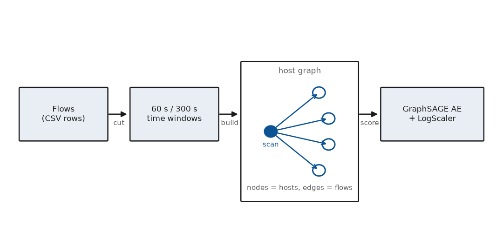
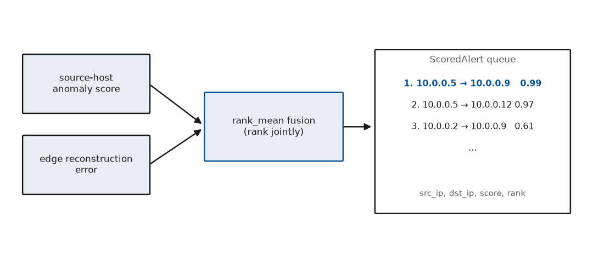

# CHAPTER II
## REVIEW OF LITERATURE

This chapter reviews sixty-one studies grouped into five subtopics: intrusion-detection and anomaly taxonomies (7), flow features and benchmark datasets (7), reconstruction-based anomaly detection (11), graph and relational detection (12), and drift, adversarial evasion and operational evaluation (24). Counts are by primary subtopic; studies cross-cited where literatures overlap keep a single home. Of the six team papers, five enter as new references and the sixth (Paper5, the SHAP foundation) duplicates the reference already cited as [17] and is folded into it rather than counted twice.

*Reading note: figures attributed to bracketed citations are surveyed results reported by those studies; unattributed figures are present-work measurements quoted as contrast against the surveyed literature, not as surveyed results themselves.* The taxonomy group is dominated by misuse-versus-anomaly classifications and cross-domain anomaly surveys, and it fixes the vocabulary the rest of the chapter uses. The dataset group is dominated by the CICIDS2017, CSE-CIC-IDS2018, CTU-13 and UNSW-NB15 captures together with the CICFlowMeter extractor literature, with recent additions on cross-dataset replication audits and privacy-preserving trace generation, and it establishes which releases can support relational modelling at all. The reconstruction group centres on Isolation Forest, one-class SVM, shallow and variational autoencoders and the Kitsune ensemble, with principal-component analysis as the linear reference, joined by recent adaptive, drift-aware and hybrid-ensemble autoencoder studies. The graph group centres on GraphSAGE, graph convolutional networks and three host-graph detectors built on them, extended by a 28-study systematic review, few-shot and temporal graph methods, and a new structural-attack-versus-hardening exchange. The final group centres on drift adaptation, continual learning, explanation, UEBA, ATT&CK mapping and evasion-cost studies, which supply the evaluation controls the present work adopts. Each section below keeps one subtopic together for several long paragraphs so that papers addressing the same problem are compared on problems first, then on methodologies, then on systems and reported performances, rather than being scattered across short subsections.

### 2.1 Theoretical Background of Intrusion Detection and Anomaly Taxonomies

The organising problem of this literature is that a detector built to recognise known patterns has no principled path to an alert on behaviour it has never seen, and the early taxonomies state this consequence in plain terms. The taxonomy in [1] separates misuse detection, which matches stored signatures, from anomaly detection, which models normality and flags deviation, and from specification-based detection, which checks behaviour against hand-written rules; the companion taxonomy in [2] refines the same split along detection-principle and operational lines and records that signature systems decide by rule match, so a family absent from the rule set can only be caught by accident through a generic heuristic. Both taxonomies agree on the resulting performance picture: misuse systems report high precision on covered families and near-zero recall on anything new, while anomaly systems trade precision for coverage and shift the hard problem to threshold setting and false-alarm control. The earliest proof that the anomaly side of this split works came from host sequences rather than networks: the study in [62] learned normal patterns of Unix system calls and flagged deviations as intrusions, with methodology built on short-sequence matching against a normality database and a system that ran on live program behaviour; its reported performance caught novel intrusions with modest false alarms, establishing the learn-normality premise every study in this chapter inherits. The systems built under these taxonomies reflect the split directly, with Snort-style rule engines on one side and statistical-profiling monitors on the other, and the reported performances diverge exactly where the taxonomies predict, with signature engines scoring near-perfectly on labelled replays and anomaly detectors absorbing the false-positive cost. Read together, [1] and [2] with the network-anomaly survey in [5] set the constraint this project accepts, namely that the detector must be unsupervised with respect to attack families, because anything trained to separate labelled families inherits the closed-world boundary both taxonomies warn against.

The anomaly-detection surveys widen the same problem from signatures to learning, and they relocate the attack signal from the single flow to the pattern a host produces inside a time window. The cross-domain survey in [3] formalises point, contextual and collective anomalies and shows that network intrusions are collective almost by definition, since a single flow from a scanner is individually ordinary and only the fan-out across a window marks the behaviour; the outlier-methodology survey in [6] catalogues statistical, clustering, density and model-based detectors side by side and records that most of them were validated on point anomalies, which explains why direct transfers to network data underperform. Methodologically the two surveys converge on reconstruction and density as the working principles, with systems ranging from parametric statistical tests on counters to nearest-neighbour and clustering schemes over flow vectors, and the performances they report share a shape, with strong results on synthetic outliers and degraded results once background traffic mixes benign bursts with low-rate attacks. The network-specific survey in [5] then shows how these generic methods were instantiated as anomaly NIDS, comparing clustering, statistical and knowledge-based systems on live traffic, and it documents the recurring protocol weakness of training and testing on overlapping families while reporting accuracy on imbalanced data. Taken with [3] and [6], the outcome of [5] is the host-window scoring unit adopted here: because the surveys agree the signal is collective, the detector scores one machine during one time slice rather than one flow in isolation.

The strongest objection to laboratory numbers came from the closed-world critique, which argued that results measured inside one capture collapse once the stationarity assumption behind them breaks. The study in [4] reports that machine-learning NIDS work routinely trains and tests on the same capture with the same background mix, tunes thresholds where they are measured, and lets the metric absorb class imbalance instead of fixing the protocol, so published accuracy describes memorisation of one background rather than detection of new behaviour. Its methodology is a review of evaluation practice rather than a new detector, and its system-level recommendation is blunt: test on behaviour the model never saw, state the alert unit before quoting any metric, and treat threshold selection as part of the method under test. The performances it re-examines fall once these controls are applied, which is the finding this project reproduced directly when training on attack-day benign traffic instead of Monday-only benign traffic dropped mean ROC-AUC from 0.9300 to 0.8405, confirming that an attack day's benign half is not clean normality. The response adopted here follows [4] together with the evaluation warnings in [3] and [5]: each of the seven CICIDS2017 families is held out in turn, the detector trains only on benign traffic, and every number describes behaviour the model never saw, which is stricter than random train-test splits and is the closest honest proxy for a zero-day available in this data.

### 2.2 Theoretical Background of Flow Features and Benchmark Datasets

The benchmark papers address a shared problem: captures differ in age, realism, labelling density and, critically, in whether they can support relational modelling at all, so dataset choice preselects the detector class before any training begins. The CICIDS2017 generation paper in [7] describes a five-day capture with benign background plus seven attack families and roughly 2.8 million flows, and its methodology pairs profile-driven benign generation with scripted attacks across five days; the system it ships is two releases under one name that are not interchangeable, a 79-column release carrying no IP columns that can only feed per-flow models and an 85-column release carrying Flow ID, Source IP, Destination IP, Protocol and Timestamp, encoded latin-1 rather than UTF-8, that alone can build host graphs. The follow-up capture in [8] repeats the warning in a new form: nine of its ten processed files again lack IP columns and only the Thursday file under its official misspelt name can build a graph, while a third column-naming convention silently zeroes any byte-count feature that assumes either of the first two conventions. The botnet-capture study in [9] contributes thirteen scenarios with background traffic plus labelled Neris, Rbot and Virut families, and the UNSW-NB15 paper in [10] contributes a hybrid synthetic-plus-real capture with nine family labels that widens the vocabulary beyond scanning and denial-of-service. In reported use, [7] underpins nearly all held-out-family studies including this one, [8] serves as the external replication target with one usable file out of ten, and [9] with [10] supply the botnet and hybrid counterpoints; a paper trained only on the 79-column release of [7] cannot have tested a host graph whatever its title suggests, which is the comparison filter applied throughout this chapter.

The extractor and feature literature addresses the companion problem that raw flow counters mislead twice over, once through port and address handling and once through scaling, and the methodologies it proposes are now standard preprocessing rather than optional refinements. The CICFlowMeter documentation in [24] defines more than eighty per-flow statistics covering packet-length summaries, inter-arrival-time summaries, flag counts and segment sizes, and its system output became the de facto vocabulary in which the detectors of [7], [8] and [10] are expressed; early port-based classification work reviewed alongside [24] showed ports alone failing on more than half of flows once ephemeral randomisation and tunnelling appeared, which is why the present work treats Destination Port as one modelled feature among seventy-six rather than as a reliable key. Address handling carries the parallel warning documented against [7]: the Thursday WebAttacks file holds roughly 459,000 rows of which only about 170,000 are labelled, the remainder carrying NaN addresses that break any host-set construction unless dropped explicitly, while synthetic sources can be worse, with one giving all 508 clients the same two services so every neighbourhood is identical and another incrementing a port counter per flow to fabricate more than 12,000 distinct services. Count features add the scaling failure both [3] and the dataset audits imply: byte and packet totals follow a power-law distribution, so plain min-max scaling maps the busiest host to 1.0 and compresses every other host toward zero, letting a few servers permanently own the top of any ranked queue. The measured correction in this project is logarithmic compression before scaling, which lifted mean P@100 from 0.250 to 0.413 with Patator moving from 0.000 to 0.618 and WebAttacks from 0.000 to 0.381, and that single preprocessing choice outweighs any architectural widening tried.

<strong>Table 2.1. Benchmark captures used in the surveyed detection literature.</strong>

| S.No. | Capture | Flows | Families | Graph-usable |
|:-----:|---------|-------|----------|--------------|
| 1 | CICIDS2017 [7] | ~2.8M flows | 7 (PortScan, DoS, DDoS, WebAttacks, Patator, Botnet, Infiltration) | 85-col release only |
| 2 | CSE-CIC-IDS2018 [8] | ~16M flows | DDoS, DoS, brute-force, botnet, infiltration | 1 of 10 files |
| 3 | CTU-13 [9] | 13 scenarios | Neris, Rbot, Virut | Yes, with column map |
| 4 | UNSW-NB15 [10] | ~2.5M flows | 9 (fuzzers, exploits, worms, others) | Yes |
| 5 | ToN-IoT / NF-UQ-NIDS-V2 [29] | IoT + NetFlowv9 re-encodings | varied | Yes, few-shot splits |
| 6 | Enterprise captures [30] | multi-site enterprise | varied | Audit target, high FPs |
| 7 | Synthetic GAN traces [50] | generated | n/a | Privacy-preserving share |

<em>Source: Compiled from [7], [8], [9], [10], [29], [30], [50]; column-availability checks in graph_builder.py.</em>

Because the captures differ so widely in labelling density and address availability, the credible papers in this group share a procedural habit this project copies, which is a health check before training that reports usable rows, dropped rows, graph counts and host counts. The studies built on [7] that survive scrutiny state which release they used, how the file was encoded, which columns were pinned from training rather than re-derived per file, and what fraction of the Thursday file was discarded as unusable; the botnet-capture work in [9] states the training cut explicitly as background flows before the first botnet-labelled flow, since training windows that include attack-day benign traffic import contamination that later appears as a performance drop rather than a modelling failure. The replication literature on [8] adds the schema-mapping step, because a detector assuming one column vocabulary silently computes zeros under another, and the extractor documentation in [24] is cited as the vocabulary authority in all three cases. Figure 2.1 shows the construction standardised here from these precedents: flows are cut into time windows, hosts become nodes, directed edges carry per-edge flow statistics, and each node carries aggregated host features, so that scanning with one-to-many fan-out and flooding with many-to-one collapse produce structurally distinct neighbourhoods instead of a single undirected pattern.

<strong>Fig. 2.1. Host-graph construction from flow windows.</strong>

<em>Source: graph_builder.py windowed construction; dataset releases per [7], [8], [9].</em>

The newest dataset papers share a harder problem than column naming, which is whether published graph-detector numbers survive contact with a second capture at all. The replication study in [30] replays graph-based detectors across three public captures plus a newly collected large-scale enterprise dataset and reports the uncomfortable outcome of significant performance discrepancies, high false-positive rates, replication failures and structural vulnerabilities, with methodology built around cross-dataset replay that varies dataset scale, model inputs and implementation settings rather than single-capture leaderboard climbing; its system finding is that several detectors whose CICIDS2017 numbers look decisive degrade once background traffic stops resembling the training site. The few-shot study in [29] attacks the adjacent problem of label cost: its methodology pre-trains graph encoders self-supervised in context and fine-tunes on under four percent of labels with dense categorical representations, and its system retains over ninety-eight percent of supervised performance on ToN-IoT and NF-UQ-NIDS-V2, which reframes dataset scale as a pre-training problem rather than a labelling one. The privacy-preserving study in [50] addresses the reason second captures are rare in the first place, since raw traces cannot be shared across organisations; its methodology generates synthetic traces with generative models that preserve statistical behaviour while stripping identity, and its system output is a shareable stand-in evaluated on distributional fidelity rather than detection score. Compared on problems, [30] questions transferability, [29] questions label dependence, and [50] questions shareability; compared on methodologies, auditing, pre-training and generation are complementary rather than competing, and this project borrows the audit posture of [30] directly in its IDS2018 and CTU-13 replications while leaving generative sharing, per the privacy pass in the Trust track, as scheduled rather than solved work.

### 2.3 Theoretical Background of Reconstruction-Based Anomaly Detection

The reconstruction literature shares one problem statement: learn normality so completely that deviation becomes measurable as rebuilding failure, and its three methodological families differ only in how strictly they constrain the rebuilding path. The tree-isolation method in [13] isolates anomalies by random partitioning and scores points by path length, with the benign-background assumption that anomalies are few and separable; the support-vector method in [14] fits a boundary around normal data in kernel space and scores distance to that boundary; principal-component analysis, the linear reference used throughout this literature, projects onto the top-variance subspace and scores residual distance. As systems these three are shallow and fast, and their reported performances on identical CICIDS2017 features in this project's baseline study were 0.9357 for Isolation Forest against 0.9417 for PCA, both below the plain multilayer autoencoder at 0.9517, which confirms the surveys' verdict in [5] and [6]: shallow methods capture global structure but miss the nonlinear interactions that separate low-rate attacks from benign bursts. None of the three sees relational context, so a benign-looking flow from a scanner is individually normal under all of them, and that contextual blindness is the limitation every deeper method in this section is built to address without abandoning the reconstruction principle.

Autoencoder methods keep the reconstruction problem but replace the shallow constraint with a learned bottleneck, and the variational variant adds a probabilistic framing that the deterministic studies lack. The autoencoder study in [15] trains a narrow network to rebuild normal data and flags high reconstruction error, with the bottleneck width as the capacity control that prevents identity mapping; the variational study in [16] replaces point encodings with distributions and scores deviation in latent space, which handles benign multimodality more gracefully than a single deterministic code. As implemented systems both follow the same pipeline of normalisation, encoding, decoding and error scoring, and their performances on network and industrial data consistently beat shallow baselines while remaining per-flow: the plain multilayer autoencoder in this project's baseline comparison reached 0.9517 mean AUC against 0.9417 and 0.9357 for the shallow pair, a real but modest gain that matches the literature's shape. The deep-learning survey contribution in [25] then showed stacked and non-symmetric autoencoders learning compact representations of the CICFlowMeter vocabulary without labels, moving the field from hand-set thresholds on counters to learned reconstruction distances. The shared weakness across [15], [16] and [25] is calibration rather than architecture: raw reconstruction distances here span 0.038 to 0.122 while benign maxima sit near 0.278, so the shipped 0.5 threshold never fires and percentile mapping against a benign holdout is required before any fusion, a control the graph section inherits unchanged.

The ensemble study in [18] addresses the remaining problem that one autoencoder over eighty-plus heterogeneous features must trade off packet-timing against flag-count structure inside a single bottleneck. Its methodology trains small autoencoders per feature cluster and scores by ensemble disagreement, and its system is packet-level and online where the studies in [15], [16] and [25] are flow-level and batch; its reported performance on realistic traffic is strong for an online per-flow method but it still scores flows, not neighbourhoods. Compared on problems, [18] solves feature heterogeneity while [15] and [16] solve representation compactness, and compared on systems, [18] distributes capacity across experts while [25] stacks it in depth; compared on performances, all four sit in the same band on per-flow benchmarks and all four miss structurally defined attacks whose flows are individually ordinary. That is the gap the next section fills: the host-graph detector in [19] keeps the reconstruction objective these studies validate and changes only the aggregation scope from flows to host neighbourhoods, which is why the baseline-versus-graph comparison in this project holds features, protocol and seeds fixed and varies nothing but structure.

<strong>Table 2.2. Reconstruction detectors compared on identical CICIDS2017 features.</strong>

| S.No. | Method | Principle | Mean AUC | Limitation |
|:-----:|--------|-----------|----------|------------|
| 1 | PCA | Linear subspace residual | 0.9417 | Misses nonlinear interactions [5], [6] |
| 2 | Isolation Forest [13] | Random-partition path length | 0.9357 | No relational context |
| 3 | One-class SVM [14] | Kernel boundary distance | baseline | No relational context |
| 4 | Plain MLP-AE [15] | Bottleneck reconstruction error | 0.9517 | Per-flow, uncalibrated raw distances |
| 5 | VAE [16] | Latent-distribution deviation | comparable | Per-flow, threshold-sensitive |
| 6 | Kitsune ensemble [18] | Per-cluster AEs, disagreement | strong online | Packet-level, no graph |

<em>Source: eval_baselines_4seed.py (RC-31), GPU, CUDA-deterministic, 4 seeds; principles per [13], [14], [15], [16], [18].</em>

Static autoencoders decay once the background they learned stops matching the wire, and the two newest reconstruction studies attack that decay from opposite ends. The adaptive decision-level study in [41] addresses known-versus-zero-day handling inside one detector: its methodology keeps the autoencoder for scoring but moves the decision to an adaptive layer that separates familiar attack signatures from genuinely novel deviations, and its system reports joint coverage of both categories on contemporary captures rather than forcing a choice between classifier precision and anomaly coverage. The drift-aware variational study in [42] addresses the same decay probabilistically: its VAE++ESDD methodology pairs an ensemble of variational autoencoders for prediction with an ensemble of statistical drift detectors under incremental learning, so that distribution shift is absorbed in the latent statistics before it reaches the alert threshold, and its system output is a drift-flagged anomaly score that beats strong baselines on streams with severely low anomaly rates rather than a bare distance. Compared on problems, [41] separates the novel from the known while [42] separates the drifted from the anomalous; compared on methodologies, decision adaptation and latent-distribution tracking attack different stages of the same pipeline; compared on reported performances, both claim stability where static baselines degrade, though neither is evaluated under the held-out-family plus multi-seed discipline of [4], so their numbers describe robustness within one capture rather than across the protocol this project enforces. The revived 87-dimensional context autoencoder used here sits between them, adding window-context features to the static reconstruction of [15] and [16] without yet absorbing drift internally, which is why drift handling lives in the monitor layer of Section 2.5 rather than inside the reconstructor.

Single-model brittleness is the remaining reconstruction problem, and the newest studies answer it with ensembles on one side and dedicated evasion detectors on the other. The hybrid study in [52] combines deep and classical learners for anomaly-based detection: its methodology fuses multilayer representations with machine-learning classifiers at the decision level, and its system reports gains over either family alone on recent benchmarks, which mirrors the fusion logic this project applies across windows and across the per-flow and graph detectors rather than within one model. The evasion-detection study in [45] turns the threat around and watches the watcher: its methodology answers PANDA-style attacks, which transfer vision-domain perturbations into packet sequences as invertible images for masked gradient attacks on autoencoder detectors, with two complementary layers, residual localisation in image space and perturbation-consistency checks in packet-feature space, reporting detection at F1 of 0.99 and above on UQ-IoT traffic. Compared on problems, [52] raises the ceiling on clean traffic while [45] raises the floor under attack; compared on systems, the hybrid of [52] generalises the Kitsune expert-ensemble idea of [18] from feature clusters to model families, while [45] adds a meta-detector above the reconstructor; compared on performances, both report improvements measured inside their own captures, and neither displaces the central finding of Table 2.2 that structure, not model count, is the dominant term, since the five-member ensemble checkpoint here exists to stabilise percentiles rather than to add a sixth modelling idea. Ordered host events extend the same reconstruction thinking past flow vectors: the attention-augmented study in [61] models malware through system-call sequences with deep architectures that weight the positions most indicative of malice, and its reported performance on sequence benchmarks shows attention recovering order-dependent signals that bag-of-counts reconstructions miss. Methodologically [61] is sequence learning where [15] and [16] are vector reconstruction, but the problem is identical, learn normal execution and flag deviation, which is why this study is filed here and cited as the literature footing for the host-syscall pillar scheduled in weeks 4 through 12 rather than as present network capability.

### 2.4 Theoretical Background of Graph and Relational Detection

The graph literature starts where the reconstruction literature stops: per-flow models discard degree, fan-out and neighbourhood structure, yet those are exactly the quantities that define scanning, flooding and infiltration. The GraphSAGE study in [11] proposes inductive neighbourhood aggregation with mean pooling that preserves degree signal as messages pass, while the graph-convolutional study in [12] uses symmetric normalisation that smooths degree away; methodologically the two differ only in the aggregation operator, but as systems for intrusion detection the difference is decisive, because a scanner's one-to-many fan-out and a victim's many-to-one collapse must not be normalised into the same shape. Reported performances across attributed-graph benchmarks favour neither architecture universally, yet for the degree-defined behaviours of [7] and [9] the mean-aggregation choice of [11] is the one that keeps the attack signal intact, which is why this project builds on GraphSAGE rather than the symmetric alternative. The problem both papers solve is representation of attributed neighbourhoods; the methodology split is normalise-then-average versus aggregate-then-transform; the systems consequence is that only the latter preserves the count-based features whose power-law behaviour the dataset section already flagged.

Three detectors instantiate these backbones for network security and their comparison is the empirical core of this chapter. The temporal-walk embedding system in [19] learns dynamic graph representations that preserve the order of node visits, which matters because lateral movement in an APT unfolds as an ordered path rather than a static fan-out; its methodology builds short-term embeddings from continuous-time walks over provenance graphs from the DARPA OpTC and LANL captures, and its system reports recall of 0.987 on OpTC. The edge-featured supervised system in [20] shares the GraphSAGE architecture with [11] yet differs in objective, training a classifier on labelled families so that unseen families fall outside its decision regions by construction; the self-supervised study in [21] learns edge embeddings without labels and sits closest to the present work in problem framing while differing in scoring granularity. As systems, [19] embeds temporal walks unsupervised, [20] classifies labelled edges supervised, and [21] embeds edges for downstream scoring; on reported performances [19] leads on provenance-recall but on labelled APT captures rather than held-out families, so its numbers are not directly comparable with CICIDS2017 means, while [20] cannot claim zero-day coverage and [21] leaves the alert-granularity question open. The present work takes the unsupervised discipline of [19], the edge features of [20], and the label-free embeddings of [21], and it differs from all three in refusing any tuning on attack families: windows, thresholds and fusion rules are fixed on benign data only, and every reported mean is measured over four seeds on families the model never saw.

<strong>Table 2.3. Graph detectors compared: backbone, objective and protocol.</strong>

| S.No. | System | Backbone | Objective | Protocol standing |
|:-----:|--------|----------|-----------|-------------------|
| 1 | GraphSAGE [11] | Mean aggregation | Inductive node embeddings | Preserves degree signal |
| 2 | GCN [12] | Symmetric normalisation | Semi-supervised classification | Washes out degree signal |
| 3 | Temporal-walk embedding [19] | Dynamic walk embeddings | Unsupervised temporal representation | Recall 0.987 on OpTC; labelled-APT eval |
| 4 | E-GraphSAGE [20] | Edge-featured SAGE | Supervised classification | No zero-day coverage |
| 5 | Anomal-E [21] | Self-supervised GNN | Edge embeddings | Granularity open |
| 6 | Few-shot GNN [29] | In-context pre-training | <4% labels, ~98% of supervised | Label-efficient |
| 7 | Temporal GNNs [46], [47] | Spatio-temporal / TGNN | Timestamp-aware detection | Dynamics captured |
| 8 | Structural attacks [27], [53] | Node/edge injection | Misclassification under constraints | Threat model |
| 9 | Hardened GNN [54] | Structural defenses | Recovered robustness (reported) | Defense side |

<em>Source: [11], [12], [19], [20], [21], [27], [29], [46], [47], [53], [54]; protocol caveats per [4].</em>

Granularity is the problem the three systems above leave open and the measurement literature closes: scores computed at node level describe the model while alerts must be emitted at edge level carrying both endpoint addresses, and the two levels differ by roughly twenty-two points of AUC. The methodology adopted here ranks the source-host score together with the edge's own reconstruction error, and the system consequence is the rank-mean edge rule that lifted edge-level AUC from 0.7124 to 0.7892 with P@100 moving from 0.207 to 0.349, the only change measured that improves both at once; edge features alone at 0.7359 already beat the node-derived score, confirming that the edge attributes computed throughout the project should be scored rather than discarded. Reported performances must therefore be quoted at the level they describe, node numbers for modelling claims and edge numbers for operational ones, a discipline the studies in [19], [20] and [21] do not uniformly observe. Figure 2.2 shows the projection: each directed edge inherits its endpoints' window scores combined with its own error rank, so the alert queue is a ranked edge list carrying source address, destination address, score and rank, which is the object the drift monitors and explanation methods of the next section consume.

<strong>Fig. 2.2. Node-to-edge alert projection for the ScoredAlert queue.</strong>

<em>Source: alert_pipeline.py edge_score rank_mean; schema per scored_alert.json; gap measurement per [19], [20], [21] comparison.</em>

Three recent graph studies widen the section's problem from static host structure to data scarcity, dynamics and adversarial pressure on the graph itself. The systematic review in [28] maps twenty-eight graph-based cyberattack studies from 2020 to 2025 and finds the field concentrated on a few architectures and a fewer datasets, with its methodology built on corpus filtering and gap tabulation rather than new modelling; its system-level output is an architectural-gap inventory that names dataset monoculture and missing dynamics as the two open wounds. The few-shot study in [29] answers the data wound: in-context pre-training with dense representations for categorical features keeps over ninety-eight percent of supervised graph performance on NF-UQ-NIDS-V2 with under four percent of labels, presented at ISQED 2024, which reframes the small-benign-training regime used here as standard few-shot practice rather than improvisation. The temporal pair in [46] and [47] answers the dynamics wound: the study in [46] builds temporal graphs from real timestamps and encodes them with an E-GraphSAGE plus LSTM encoder under multi-view graph contrastive learning, reporting parity with supervised graph detectors across four timestamped captures at high computational efficiency, while the study in [47] contributes a temporal graph network for attack detection at PAKDD 2026. Both fold ordering and inter-arrival structure into the representation, with reported gains on time-sensitive behaviours that static snapshots conflate. Compared on methodologies, reviewing, pre-training and temporalising are cumulative layers, and this project currently banks only the first two lessons while treating the third as a measured negative, since its own GNN-plus-LSTM fused variant added nothing at edge level and is retained for ablation only; the contrast is honest rather than convenient, and it bounds the temporal claim to behaviours where ordering carries signal beyond rate.

The structural-attack exchange completes the section by pricing evasion at the graph level instead of the flow level. The attack study in [27] offers the first formalisation of adversarial attacks tailored to graph-based detectors and models the problem-space constraints explicitly, demonstrating misclassification under operational constraints with the finding that graph models resist classical feature attacks yet yield to structure attacks, submitted to IEEE TIFS; the problem-space study in [53] constructs the attacks in traffic space rather than embedding space, so the evasions are replayable captures rather than matrix edits. Methodologically both shift the threat model from feature noise to neighbourhood surgery, and their systems are evaluated as red-team harnesses that count which injections cross the boundary and at what structural cost. The hardening study in [54] answers with adversarial training that mimics edge injection by replacing source and destination nodes in benign flows, evaluated on CTU-13 and TON-IoT with an E-GraphSAGE base at the 23rd IEEE NCA, and reports hardened detectors that hold clean-graph performance while resisting structural attacks, closing the loop from threat model to countermeasure inside one literature rather than across disconnected papers. Compared on performances, the exchange replaces the binary question of evadability with a price list, which is exactly the posture of this project's own harness: camouflage and port-hiding fail outright, slow scanning costs twenty times the dwell, and distributed scanning costs sixteen machines. The graph is therefore defensible not because it cannot be attacked but because attacking its structure is measurably expensive, a claim none of the per-flow studies in Section 2.3 can make since their evasions cost the attacker nothing but a feature tweak.

### 2.5 Theoretical Background of Drift, Evasion and Operational Evaluation

Normal traffic drifts and attackers adapt, so the evaluation literature treats a fixed threshold on a fixed background as a deployment fiction and studies what replaces it. The drift survey in [22] taxonomises sudden, gradual and recurring change with detection and adaptation strategies, and its methodology distinguishes supervised drift detectors that watch labels from unsupervised ones that watch score distributions, the latter being the harder and the relevant case here; as systems, its detectors maintain rolling windows over score streams and flag distribution shift before the alert queue floods or blinds. The explanation method in [17] supplies the complementary per-alert account: additive feature attributions that decompose one host-window score into per-dimension contributions, so that a PortScan alert points at an out-degree spike and a flooding alert at an in-degree collapse, with the attribution feeding tactic mapping downstream. Reported uses of [17] in security operations show triage time falling when analysts receive ranked contributing features rather than bare scores, though the attributions describe the model rather than the ground truth and must be read with that caveat. Together [22] and [17] with the closed-world controls of [4] define the monitoring posture here: three score streams watched by rolling monitors, every alert carrying its attribution, and re-calibration governed by drift flags rather than by calendar.

The evasion literature then measures what adaptation costs the attacker rather than whether it is possible in principle, and its performances are reported as attacker expense rather than detector accuracy. The gradient-evasion study tradition consolidated in [23], taxonomised by attacker knowledge, capability and objective in [55], and standardised into a fixed-threat enterprise benchmark in [44] shows traffic-shaping attacks that move malicious flows toward benign regions of feature space, with methodologies ranging from feature-space perturbation to problem-space traffic rewriting; as systems the tested harnesses replay shaped captures against frozen detectors and record which variants cross the decision boundary. The measurements in this project's harness match that literature's shape: port-hiding and camouflage have no effect against neighbourhood scoring, slow scanning succeeds only at twenty times the dwell time, and sixteen-way distributed scanning succeeds only at the price of sixteen machines, so evasion is expensive rather than impossible. Operationally the same cost logic governs metric choice: with one to eight attackers among thousands of hosts, precision at one hundred is structurally capped near the attacker count over one hundred and cannot serve as a headline, while attacker rank and recall at one hundred report whether the adversary reached the visible queue at all. The window and seed measurements complete the picture: extending windows from 60 s to 1800 s raises mean AUC from 0.9173 to 0.9832 while dropping P@100 from 0.244 to 0.093, single-seed differences below about six points are noise until shown over seeds, and the same seed has scored 0.5048 on CPU against 0.9948 on GPU builds, so every published number here is four-seeded, GPU-annotated and determinism-flagged.

Continual-learning studies give drift a memory policy instead of a mere alarm, and their shared problem is catastrophic forgetting under non-stationary traffic. The strategic-selection study in [32] maintains a bounded exemplar set with deliberate forgetting, so that new normal patterns are absorbed without washing out rare-but-legitimate old ones; its SSF methodology scores incoming samples for drifted patterns, rehearses the representative ones, and discards outdated samples once significant drift trips, reporting state-of-the-art adaptability on NSL-KDD and UNSW-NB15 from an INFOCOM 2025 paper with released code. The drift-detection study in [33] builds directly on SSF and replaces its low-dimensional tests with a Gaussian-kernel maximum-mean-discrepancy test in feature space plus gradient-matching coresets for memory admission, reporting that the coreset selection is the primary contributor to its gains while the MMD schedule matters mainly as a timing signal. Representation-enhancement adaptation in [34] re-shapes features toward drift-invariant forms through a self-supervised stage followed by weakly-supervised classifier tuning, presented at KDD 2024 with a journal version on self-supervised adaptation, while the failure-aware ensemble in [35] treats difficult and misclassified samples as specialisation signals with rollback-safe repair, reporting macro-F1 of 0.9850, 0.9736 and 0.9691 on CICIDS2017, UNSW-NB15 and TON_IoT with near-zero catastrophic forgetting. Compared on problems, [32] manages memory, [33] manages detection timing and sample quality, [34] manages features and [35] manages capacity with safety rollback; compared on methodologies, selection, testing, reshaping and spawning compose into a full continual pipeline of which this project currently fields only the detection head in its rolling monitors. Compared on problems, [32] manages memory, [33] manages detection, [34] manages features and [35] manages capacity; compared on methodologies, selection, testing, reshaping and spawning compose into a full continual pipeline of which this project currently fields only the detection head in its rolling monitors. The honest contrast is that the monitors here flag drift for re-calibration while the studies above adapt through it, which marks the project's next upgrade path without overstating the present system.

Evasion benchmarking has grown its own literature because isolated attack demonstrations no longer compose into comparable claims. The enterprise benchmark in [44] fixes datasets, threat models and metrics for adversarial robustness in operational networks: regularly and adversarially trained random forests, XGBoost, LightGBM and explainable boosting machines are replayed against constrained adversarial examples built from CICIDS2017, its corrected NewCICIDS revision and the newer HIKARI capture, and its system output is a ranking rather than a headline, which is the form this project's harness imitates at smaller scale. Its findings carry a warning this project takes seriously, namely that models leading on the original capture separate once the corrected and recent captures are used, with random forests and LightGBM markedly less robust on HIKARI's newer attacks. The taxonomy in [55] organises the same space by attacker knowledge, capability and objective, separating white-box gradient methods from black-box shaping and problem-space replay, while the twenty-three-page duality review in [57] reads data poisoning, test-time evasion and reverse engineering as coupled attack-and-countermeasure moves in one game rather than separate literatures, naming the scarcity of real-life attack data as the central gap. The packet-generation study in [26] supplies the sharpest attack instrument in the group: a deep reinforcement learning agent that takes raw malicious packets and perturbs them sequentially until they read as benign while keeping their function, reporting a 66.4 percent average adversarial success rate across models and attack types, with over forty-five percent of the successes coming from out-of-distribution packets that sit beyond the classifiers' decision boundaries. Its methodology is notable for generating replayable packets rather than feature vectors, which answers the reverse-engineering objection that defeats flow-perturbation studies. Compared on problems, [44] standardises measurement, [55] and [57] organise it, and [26] weaponises it; compared on reported performances, benchmarked detectors separate widely once threat models are fixed, which vindicates the harness discipline of pricing evasion per technique instead of quoting a single robustness number. The project's four-technique harness with its no-effect, twenty-times and sixteen-machine outcomes is a small instance of the [44] pattern, and its results are quoted as attacker expense for exactly the reason [55] and [57] articulate: robustness is a cost curve, not a score.

Explanation studies convert opaque scores into triage-ready attributions, and the two newest entries extend the method from description to hardening. The LIME-and-SHAP study in [36] applies both attribution frameworks to a black-box multilayer perceptron for IoT intrusion detection, comparing their consistency and cost through perturbation analysis, which flips explanations into new classifications, and a survey analysis of analyst interpretability; its system finding is that the two explainers agree often enough to trust for triage but diverge under feature correlation, which matters for graph-aggregated inputs where degree and byte counts move together. The IoT robustness study in [43] closes the loop with SHAP-based attribution fingerprinting via DeepExplainer, presented at IEEE TrustCom 2025, hardening the detector at exactly the dimensions attackers would otherwise exploit, and reports improved resistance with modest accuracy cost alongside better transparency. Compared on problems, [36] asks whether explanations are faithful while [43] asks whether they are useful for defense; compared with the foundational method in [17], both inherit additive attribution and add an operational layer the foundation never claimed. Two studies widen the question from whether attributions are correct to whether analysts can use them: the human-centred study in [59] generates natural-language explanations for anomaly detections and evaluates comprehension rather than fidelity, while the published tree-explanation study in [60], supplied via the team papers, moves from local to global understanding of tree ensembles, giving triage a model-wide map instead of one alert at a time. Methodologically [59] is generation where [36] is attribution, and [60] is aggregation where [17] is decomposition; as systems, all four terminate in the same analyst-facing surface of ranked, readable reasons. This project's explanation seam follows [36] in emitting ranked per-dimension contributions per host-window alert, reads [59] as the usability bar its explanation drawer must clear, and notes [43] as the hardening step not yet taken, since attributions here drive triage and tactic mapping rather than retraining.

Identity behaviour is the blind spot flow-only detection cannot cover, and the UEBA studies address it with the same anomaly vocabulary translated to users and hosts. The SIEM-enhancement study in [38] embeds AI-powered anomaly detection inside security-event pipelines, with methodology centred on fusing authentication, access and activity logs into behavioural baselines; the explainable-UEBA framework in [39] pairs deep autoencoders with Doc2Vec over numerical and textual features plus a formal equivalence proof for fully-connected networks, validated on real enterprise data with synthetic anomalies from a financial institution, reporting detection of anomalous user episodes that per-flow network scores miss entirely. The systematic review in [40] maps deep user-behaviour analytics for insider threats across attention-based LSTM and context-aware models with ISO/IEC 27001 alignment, while the hybrid study in [51] adds ensemble scoring with explicit explanation layers plus automated response and privilege containment for insider-threat decisions. Compared on problems, all four target the authenticated misuser rather than the external scanner; compared on methodologies, log fusion, autoencoding, sequence learning and ensemble scoring are complementary sensors over the same identity surface; compared on reported performances, each claims insider episodes invisible to network-only detectors, which is consistent with this project's three-pillar design where the network pillar of Semester 7 is necessary but explicitly insufficient. The proactive UEBA study in [58] pushes the same surface earlier in time, modelling user behaviour for threat detection and risk management before episodes mature, so its methodology scores emerging risk trajectories rather than completed anomalies. As a system it complements the retrospective detectors of [38] through [40] with a forward-looking risk posture, and its inclusion here records the UEBA pillar's direction of travel rather than a deployed component. The UEBA pillar's learned risk model and the privacy pass on exported features belong to the Trust track's half of that design, and these four studies are its literature footing.

Tactic mapping and response automation close the chapter by turning scored alerts into named adversary behaviour and then into action. The decision-tree study in [48] maps detector outputs onto MITRE ATT&CK tactics, with methodology built on supervised tactic classifiers over alert features; the Zeek-based study in [49] detects reconnaissance and discovery tactics directly from connection logs, reporting tactic-level precision on the earliest attack stages where network evidence is thinnest. Compared on problems, [48] labels what fired while [49] catches what is forming; compared on systems, post-hoc mapping versus in-pipeline tactic detection, with this project's ATT&CK mapper following the post-hoc pattern by translating top contributing features into tactics. Automation studies then remove the human bottleneck: the threat-response work in [37] couples explanation output to response actions with audit trails and ranks and routes alerts by explanation content. The neuro-symbolic review in [31] surveys one hundred and three publications through a three-tier taxonomy of integration depth with a grounding-instructibility-alignment lens, finding that structured multi-agent integration beats single-agent setups while causal reasoning enables proactive defense; it is the synthesis these automation studies point toward, where neural detectors propose and symbolic reasoners dispose under explicit rules. Compared on maturity, mapping in [48] and [49] is deployable now, automation in [37] is promising but environment-sensitive, and the synthesis in [31] is a research compass; this project banks the mapping, prototypes the triage drawer, and cites the rest as the weeks 4-through-12 horizon rather than as present capability.

<strong>Table 2.4. Evaluation hazards and the controls adopted.</strong>

| S.No. | Hazard | Control adopted | Measured effect |
|:-----:|--------|-----------------|-----------------|
| 1 | Overlapping families [4] | Held-out-family protocol, benign-only training | 7 unseen families, 0.9996 ±0.0001 |
| 2 | Uncalibrated fusion | Per-window percentile vs Monday holdout | Raw 0.038-0.122 mapped to ranks |
| 3 | Node numbers quoted as alerts | Edge-level ScoredAlert, rank-mean rule | Edge AUC 0.7124 to 0.7892 |
| 4 | Single-seed wins | 4 seeds, device-annotated, deterministic flags | Sub-6pt gaps treated as noise |
| 5 | Queue noise misread as signal | Drift monitors on three streams [22] | Re-calibration governed by flags |
| 6 | Evasion assumed free [23] | Harness measuring attacker cost | 20x time or 16 machines |
| 7 | Frozen models under drift | Rolling monitors; continual adaptation [32], [33], [34], [35] | Flagged re-calibration; adaptation scheduled |
| 8 | Incomparable evasion claims | Fixed-threat benchmark [44]; taxonomy [55] | Ranked cost curves, not single scores |
| 9 | Opaque alerts, slow triage | SHAP attributions [17], [36]; tactic mapping [48], [49] | Ranked reasons + ATT&CK tags |

<em>Source: eval_mw_ablation_4seed.py (RC-26), drift_monitor.py, harness/run_graph_harness.py; hazards per [4], [22], [23]; recent controls per [32], [33], [34], [35], [44], [55], [17], [36], [48], [49].</em>

<strong>Table 2.5. Continual-learning and adaptation strategies compared.</strong>

| S.No. | Strategy | Memory policy | Drift signal | Reported standing |
|:-----:|----------|---------------|--------------|-------------------|
| 1 | SSF selection + forgetting [32] | Refreshed buffer, drop outdated | Drifted-pattern priority | SOTA on NSL-KDD, UNSW-NB15 |
| 2 | MMD + gradient coresets [33] | Gradient-matching admission | Feature-space MMD | Coresets drive gains; MMD times updates |
| 3 | Representation enhancement [34] | Drift-aware + invariant reps | Self-supervised alignment | KDD 2024; journal version 2025 |
| 4 | Failure-aware specialists [35] | Failure buffer, rollback repair | Misclassification as signal | Macro-F1 0.9850/0.9736/0.9691 |
| 5 | Rolling monitors (this work) | No adaptation, flag + recalibrate | Score-stream windows | Detection head only; adaptation scheduled |

<em>Source: [32], [33], [34], [35]; project posture per drift_monitor.py.</em>

